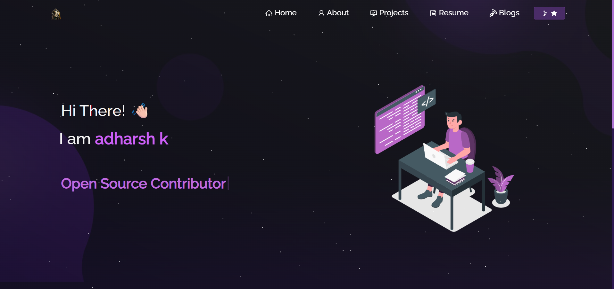

# Adharsh K. - Portfolio

Hi, I'm **Adharsh K.** 👋
I'm a passionate and curious tech enthusiast who loves building projects, exploring system internals, and learning new technologies. I enjoy working on open-source projects, creating interactive games, and diving deep into operating systems, networking, and backend development.

---
## Attribution
This project is originally inspired by [Original Author's GitHub Profile](https://github.com/soumyajit4419). Proper credits are given in the LICENSE file.
## 📸 Preview

## 🚀 About Me

* 🔧 I love building **tools, games, and system-level projects**.
* 🎮 Currently working on a **chess project**, including a custom GUI and aiming to build my own chess AI.
* 🌐 Interested in **full-stack development**, with experience using **HTML, CSS, JavaScript, Node.js, and Python**.
* 💻 Learning about **operating systems, shell scripting, and networking** in depth.
* 🛠️ Exploring hardware-level projects like **DIY home routers** and considering **floating solar panel** installations.
* 📖 Actively contributing to open-source and always looking to improve my skills.

---

## 🛠️ Tech Stack

* **Frontend:** HTML, CSS, JavaScript
* **Backend:** Node.js, Python, Flask
* **Tools:** Git, GitHub, CMD, PowerShell
* **Others:** OS fundamentals, Networking basics, Shell scripting, Chess GUI programming

---

## 📂 Projects

* **Chess Game with Custom GUI**

  * Building a playable chess game with plans to integrate a custom chess AI.

* **Two Cars Two**

  * An advanced version of the "Two Cars" game with three lanes and more complexity.

* **Floating Solar Panel Feasibility Study**

  * Exploring potential solar solutions using floating panels in underutilized water bodies.

---

## 🌐 Connect with Me

* GitHub: [https://github.com/shadows-codinghub](#)
* LinkedIn: *(https://www.linkedin.com/in/adharsh-k-716a99327/)*
* Email: *(adharshkandath@gmail.com)*

---

## 📫 Contact

*Feel free to reach out if you want to collaborate, need help, or just want to chat about tech and projects!*

---
